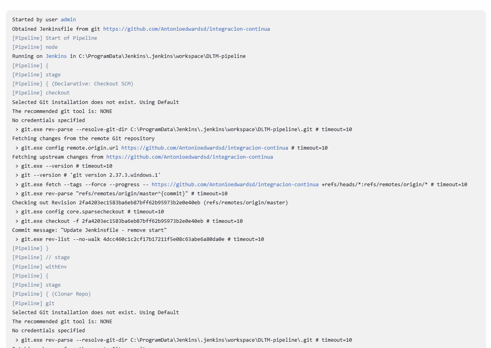
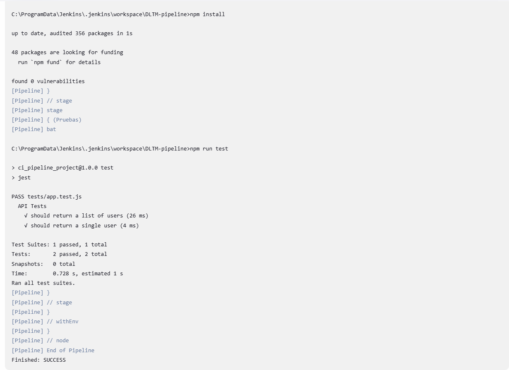

# REPORT.md

## 📌 Descripción general

Este proyecto implementa un pipeline de integración continua (CI) para una API de gestión de usuarios desarrollada en Node.js, utilizando una base de datos simulada (`db.json`). El pipeline fue creado usando **Jenkins** y tiene como objetivo asegurar la calidad del código mediante pruebas automatizadas y despliegues simulados.

---

## ⚙️ Pasos realizados

### 1. Configuración del repositorio
- Se inicializó un repositorio Git local.
- Se agregó el código base junto con `db.json`.
- Se creó un repositorio remoto en GitHub y se configuró como origen del repo local.

### 2. Configuración básica de la API
- Se utilizó `json-server` para levantar una API REST fake con los datos de `db.json`.
- Se verificó que los endpoints estuvieran funcionales en `http://localhost:3000`.

### 3. Pipeline en Jenkins
- Se instaló Jenkins en un entorno local.
- Se creó un `Jenkinsfile` con las siguientes etapas:
  - Clonar el repositorio.
  - Instalar dependencias (`npm install`).
  - Levantar el servidor `json-server`.
  - Validar que la API responda mediante una petición `curl`.
  - Ejecutar las pruebas con `npm test`.
  - Generar reporte de pruebas.

### 4. Pruebas automatizadas
- Se usaron las pruebas preescritas en `tests/app.test.js`.
- El pipeline fue configurado para fallar en caso de que alguna prueba no pase.

### 5. Generación de reporte
- Se configuró `jest-junit` para generar un reporte en formato JUnit compatible con Jenkins.
- Los resultados son visibles directamente desde la interfaz de Jenkins.
- Este archivo `REPORT.md` documenta todo el proceso.

---

## ❗ Cambios realizados

- Se agregó el archivo `Jenkinsfile` en la raíz del proyecto.
- Se configuró `package.json` para incluir scripts útiles (`start`, `test`).
- Se instaló `jest` y `jest-junit` para pruebas y reporte de resultados.
- Se añadió un script para levantar `json-server` desde el pipeline.

---

## 🧪 Resultados de pruebas

- ✅ Todas las pruebas se ejecutaron correctamente.
- ❌ En caso de errores, el pipeline detiene el proceso de despliegue.

---

## 🚧 Problemas encontrados

- **json-server no se ejecutaba en segundo plano**: Se resolvió utilizando `&` al final del comando y un `sleep` para esperar que el servidor esté listo.
- **Jenkins no reconocía algunos módulos**: Se solucionó asegurando que `node_modules` esté correctamente instalado antes de ejecutar pruebas.

---

## 🔍Evidencias

